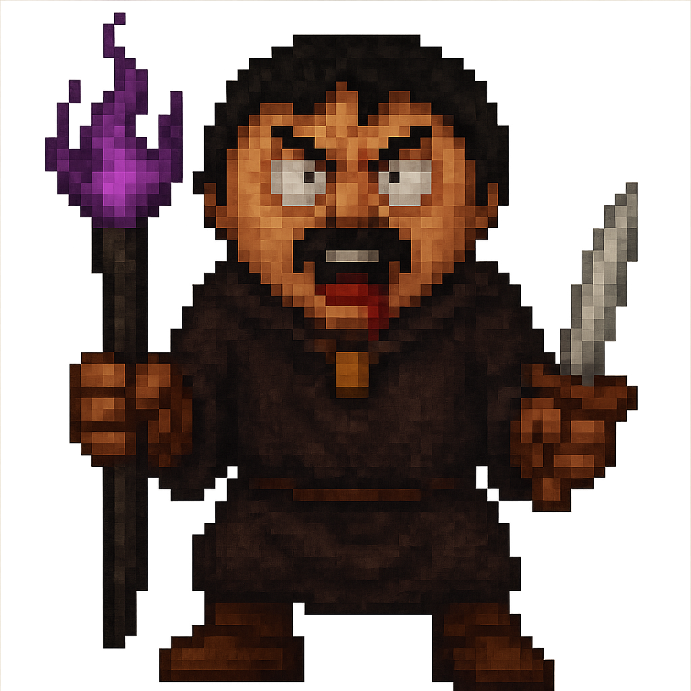
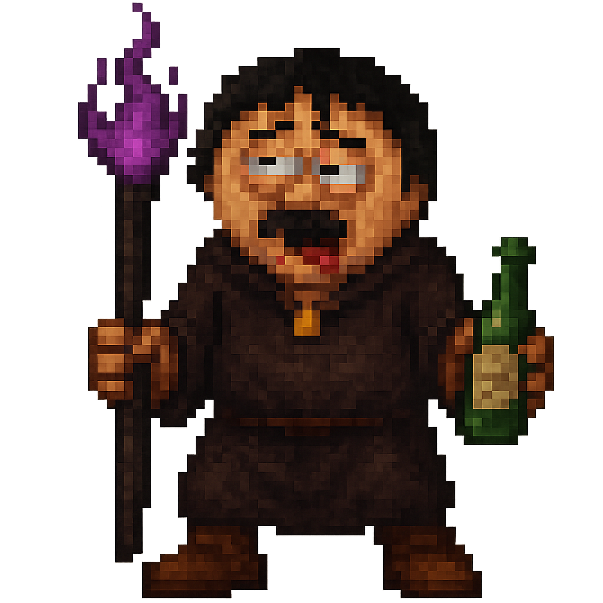
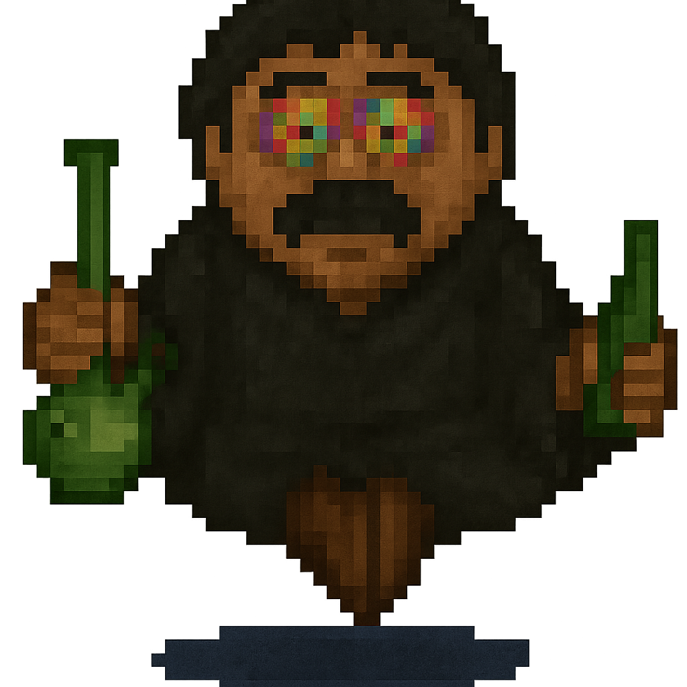

# 🧙‍♂️ Cub3D - 𝔗𝔦𝔱𝔦 𝔗𝔞𝔱𝔞 𝔗𝔲𝔱𝔲 𝔗𝔬𝔱𝔬: The Quest for Randy Marsh

> A 42 school project turned into a fantasy adventure game, where you play as a wizard roaming haunted catacombs filled with twisted enemies and psychedelic secrets...

---

## 👥 Team

- Alexandre Lacroix
- Alexandre Gadea — https://github.com/algadea

---

## 📖 About

Cub3D is a raycasting engine inspired by *Wolfenstein 3D*, developed as part of the 42 school curriculum.
It taught us the fundamentals of **3D rendering**, **real-time event handling**, and **texture manipulation** in C using the MiniLibX graphics library.

### 🚀 Extended Universe

We went far beyond the mandatory scope to turn Cub3D into a **fantasy-themed mini-game**.

You play as a **wandering wizard**, armed with a **magic staff** and a **mystical sword**, exploring the catacombs in search of **Randy Marsh**, a former ally who became a **dark sorcerer**.

---

## ✨ Features

### ✅ Mandatory (42 subject)
- Functional raycasting engine (3D rendering from a 2D map)
- Smooth player movement (forward/backward/strafe + rotation)
- Wall collision detection
- `.cub` file parsing
- Custom textures for walls, floor, and ceiling
- MiniMap
- Mouse support (bonus)

### 🔥 Bonus & Enhancements
- **💊 Psychedelic mode**: a hidden item shifts the world into a colorful distorted realm
- **🧙‍♂️ Animated enemies**: face off against various forms of **Dark Randy Marsh**
- **⚔️ Combat animations**: attack effects for staff and sword
- **🌈 Animated sprites**: dynamic visuals for enemies, objects, and spell effects

---

## 👾 Enemies: The Many Faces of Randy Marsh

Meet the multiple incarnations of the dark wizard Randy Marsh throughout your journey:

| Stoned Randy                    | Angry Randy                    |
|--------------------------------|--------------------------------|
|  |  |

| Drunk Randy                    | Godlike Randy (Psychedelic)    |
|--------------------------------|--------------------------------|
|  |  |

---

## 🧠 Controls

- `W / A / S / D` : Move
- `← / →` : Rotate left / right
- `LEFT_MOUSE` : Cast spell
- `RIGHT_MOUSE` : Sword attack
- `E` : Interact (open doors, collect items)
- `ESC` : Game menu

---

## 🛠️ Installation

### Requirements
- UNIX-based system (Linux or macOS)
- `make`, `gcc`, `MiniLibX`

### Clone the repository
```bash
git clone https://github.com/A1astar/cub3d.git
cd cub3d
make
./cub3d maps/catacombs.cub
```
